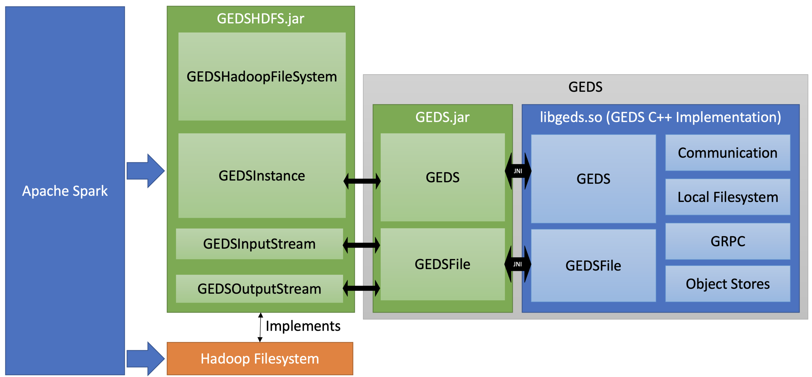

# Hadoop Filesystem Implementation for GEDS

This project implements the [Hadoop Fileystem API](https://hadoop.apache.org/docs/current/hadoop-project-dist/hadoop-common/filesystem/index.html) for GEDS.

## Design

Apache Spark and Hadoop interact with GEDS in the following way:



## Building

Make sure SBT is installed on the system. Install GEDS and then run the package script:
```bash
export GEDS_INSTALL=$HOME/geds-install # GEDS install path
sbt package
```
The library will be located in `target/scala-2.12/`.

## Testing

The tests can be executed by running `sbt test`. The backing object store can be configured with the following environment variables:

- `TEST_BUCKET`: Bucket for the storage location (default: `test`)
- `AWS_ACCESS_KEY_ID`: The access key for the object store (default: `minioadmin`)
- `AWS_SECRET_ACCESS_KEY`: The secret access key for the object store (default: `minioadmin`)
- `AWS_ENDPOINT_URL`: The URL of the backing object store (`http://10.100.0.15:9000`)

## Configuration

Place the GEDS-HDFS plugin, `geds.jar` into the Java class path, and `libgeds_java.so` into the `LD_LIBRARY` path. GEDS can then be configured with the following variables:

- `fs.geds.impl`: `com.ibm.geds.hdfs.GEDSHadoopFileSystem` - **Required**
- `fs.geds.metadataserver`: Ip or DNS of the metadata server - **Required**
- `fs.geds.blocksize`: GEDS block size in bytes. Example: `33554432`
- `fs.geds.path`: Local GEDS path for ephemeral data. A path that ends with `XXXXXX` will be randomized with `mktempd`. Default: `/tmp/GEDSHadoop`. - Optional
- `fs.geds.port`: Local port for the GEDS service. - Optional

GEDS allows mapping individual buckets to S3. For each bucket, the following configuration variables can be passed to enable a S3 mapping.
- `fs.geds.BUCKET_NAME.accessKey`: S3 Access key for `BUCKET_NAME`.
- `fs.geds.BUCKET_NAME.secretKey`: S3 Secret key for `BUCKET_NAME`.
- `fs.geds.BUCKET_NAME.endpoint`: S3 Endpoint to use for `BUCKET_NAME`.

### Example Spark configuration

The bucket `zrlio-tpcds` is mapped to S3 to enable caching.

```
  --conf spark.hadoop.fs.geds.impl="com.ibm.geds.hdfs.GEDSHadoopFileSystem"
  --conf spark.hadoop.fs.geds.metadataserver="geds-service:40001"
  --conf spark.hadoop.fs.geds.blocksize=$((32*1024*1024))
  --conf spark.hadoop.fs.geds.path=/geds
  --conf spark.hadoop.fs.geds.zrlio-tpcds.accessKey="${S3A_ACCESS_KEY}"
  --conf spark.hadoop.fs.geds.zrlio-tpcds.secretKey="${S3A_SECRET_KEY}"
  --conf spark.hadoop.fs.geds.zrlio-tpcds.endpoint="${S3A_ENDPOINT}"
  ```

## Implementation Notes

### FileSystem construction

The Hadoop FileSystem constructor is called once per `hostname` in the filesystem URI.

- For `s3a` this means, that for every bucket there is a separate instance of the `S3AFilesystem`. Each
  bucket is accessed through `s3a://bucket/key`. For each bucket we can define different S3 credentials or an endpoint.
- For `crail` this means, that the constructor for `CrailHDFS` is called once, since the Crail filesystem is based on
  the URL to the namenode. There is typically only one Crail namenode running.
  Crail filesystems are typically defined with `crail://namenode:port/`.
- For `geds` we want to emulate the `s3a` model to keep the bucket configuration, but forward the calls to a single `GEDS` instance.
  This allows us to add additional configuration (for example S3 mapping) for each bucket.
  Each `GEDSHadoopFileSystem` instance will forward the calls to a `GEDS` singleton. The singleton also allows us to more
  efficiently cache files locally.

### Folders

Hadoop implements folders on Key/Value filesystems by placing an empty key with the name `_$folder$`.

**Example**: A folder structure `Nase/Baer` would create the following keys on the key/value filesystem:
- `Nase/_$folder$`
- `Nase/Baer/_$folder$`

### Rename

The Hadoop API specifies the following API for renaming paths ([source](https://github.com/apache/hadoop/blob/trunk/hadoop-common-project/hadoop-common/src/main/java/org/apache/hadoop/fs/FileSystem.java#L1591-L1598)):
```Java
  /**
   * Renames Path src to Path dst.
   * @param src path to be renamed
   * @param dst new path after rename
   * @throws IOException on failure
   * @return true if rename is successful
   */
  public abstract boolean rename(Path src, Path dst) throws IOException;
```

- Rename needs to return `true` if the command has been successful
- An `IOException` otherwise.

### Sample implementations

Below is a list of projects that implement the Hadoop Filesystem which we can use as a reference.

- **s3a://** [S3AFileSystem](https://github.com/apache/hadoop/blob/trunk/hadoop-tools/hadoop-aws/src/main/java/org/apache/hadoop/fs/s3a/S3AFileSystem.java)

  Minimal config:
  ```
  --conf spark.hadoop.fs.s3a.access.key=Nase
  --conf spark.hadoop.fs.s3a.secret.key=Baer
  --conf spark.hadoop.fs.s3a.endpoint=http://endpoint/
  --conf spark.hadoop.fs.s3a.impl=org.apache.hadoop.fs.s3a.S3AFileSystem
  ```
- **crail://** [CrailHDFS](https://github.com/craillabs/crail/blob/master/hdfs/src/main/java/org/apache/crail/hdfs/CrailHDFS.java)

  Minimal config:
  ```xml
  <property>
   <name>fs.crail.impl</name>
   <value>org.apache.crail.hdfs.CrailHadoopFileSystem</value>
  </property>
  <property>
    <name>fs.defaultFS</name>
    <value>crail://localhost:9060</value>
  </property>
  <property>
    <name>fs.AbstractFileSystem.crail.impl</name>
    <value>org.apache.crail.hdfs.CrailHDFS</value>
  </property>
  ```

  *Note*: Crail is special since it defines `fs.defaultFS` and uses `AbstractFileSystem` as a base implementation. For our use-case we want to model the `s3a`-approach:

  - We don't want to override `fs.defaultFS`
  - `GEDSHadoopFileSystem` should inherit from `org.apache.hadoop.fs.FileSystem` directly
- **https://** [AbstractHttpFileSystem](https://github.com/apache/hadoop/blob/trunk/hadoop-common-project/hadoop-common/src/main/java/org/apache/hadoop/fs/http/AbstractHttpFileSystem.java)

  *Note*: This filesystem does not allow listing objects.
